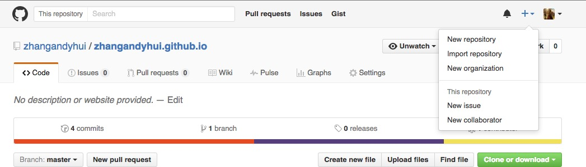
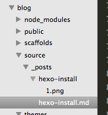
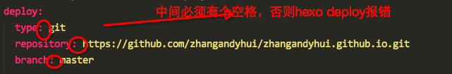

# 引言
本工作的根本目的是在Github上搭建一个个人博客。其优点是免费，而且可以学习Git。因此本人从今天开始打算将博客平台转移到Github上来。

Github上可以用来搭建博客的工具大概有三个：Hexo, Jekyll, octopress等。但是经过研究发现最好的方式还是采用Github + Hexo的方式，因此这里介绍的方法正是基于该方法。
## 安装前准备条件
   node github(若没有可自己注册)
## github建立仓库
   登录后新建仓库，命名必须为username.github.io.注：Github Pages的Repository名字是特定的，比如我Github账号是zhangandyhui，那么我Github Pages Repository名字就是zhangandyhui.github.io
   
## Hexo安装


``` bash
$   npm install -g hexo-cli
$   npm install hexo --save
```

##  部署Hexo（node v6.0以上需要卸载hexo-generator-feed,否则编译报错)
``` bash
$   hexo init blog
$   cd blog
$   npm install
```

### hexo插件安装
``` bash
	npm install hexo-generator-index --save
	npm install hexo-generator-archive --save
	npm install hexo-generator-category --save
	npm install hexo-generator-tag --save
	npm install hexo-server --save
	npm install hexo-deployer-git --save
	npm install hexo-deployer-heroku --save
	npm install hexo-deployer-rsync --save
	npm install hexo-deployer-openshift --save
	npm install hexo-renderer-marked --save
	npm install hexo-renderer-stylus --save
	npm install hexo-generator-sitemap --save
```

### 测试本地效果
    hexo g,hexo s登录localhost:4000查看效果

## Hexo主题Yilia
### 1.安装
``` bash
$   git clone https://github.com/litten/hexo-theme-yilia.git themes/yilia
```
### 2.配置
修改hexo根目录下的**_config.yml** :`theme:yilia`
### 3.更新
``` bash
$   cd themes/yilia && git pull
```
### 4.配置theme/yilia/_config.xml
```
# Header
menu:
  主页: /
  所有文章: /archives
  # 随笔: /tags/随笔
# SubNav
subnav:
  github: "https://github.com/zhangandyhui/zhangandyhui.io"
  weibo: "#"
  rss: "#"
  zhihu: "#"
rss: /atom.xml
# Content
excerpt_link: more
fancybox: true
mathjax: true

# 是否开启动画效果
animate: true

# 是否在新窗口打开链接
open_in_new: false

# Miscellaneous
google_analytics: ''
favicon: /favicon.png

#你的头像url
avatar: "https://avatars1.githubusercontent.com/u/10860119?v=3&s=460"
```

## 	插件
图片插件
    安装 	npm install https://github.com/CodeFalling/hexo-asset-image --save
    配置：blog根目录下`_config.yml`中**`post_asset_folder:true`**
	使用如： ``
	项目结构：
##  部署
修改blog根目录下的`_config.yml`文件
		